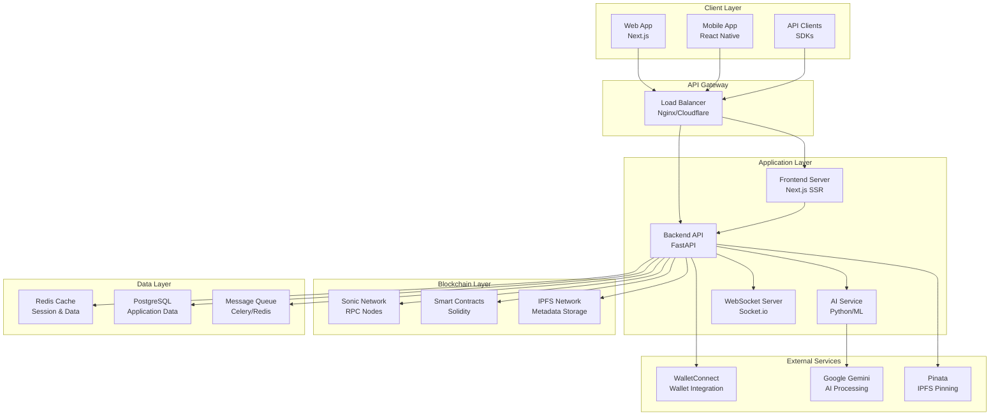
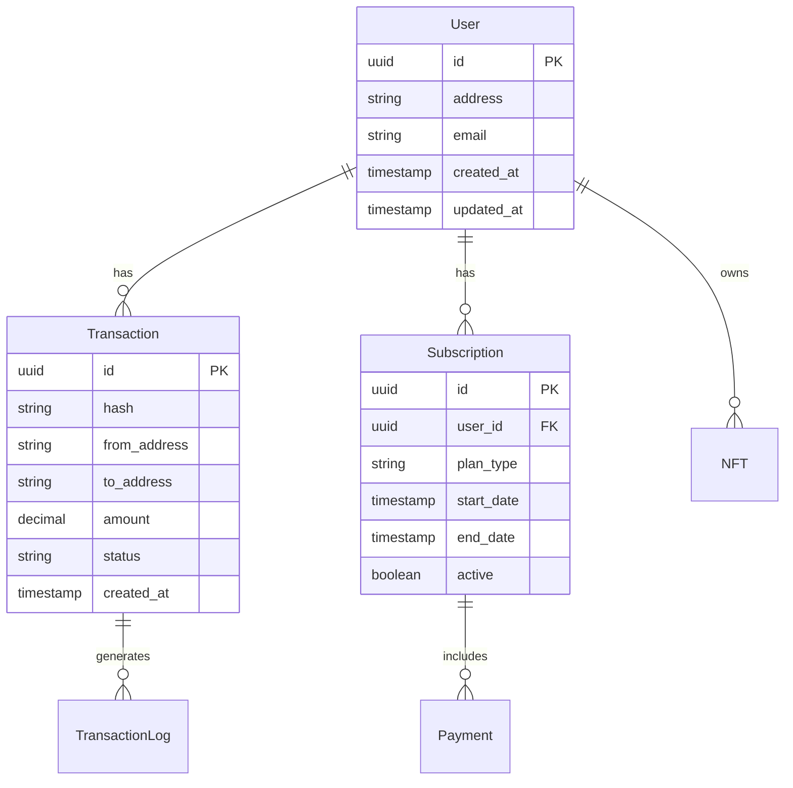
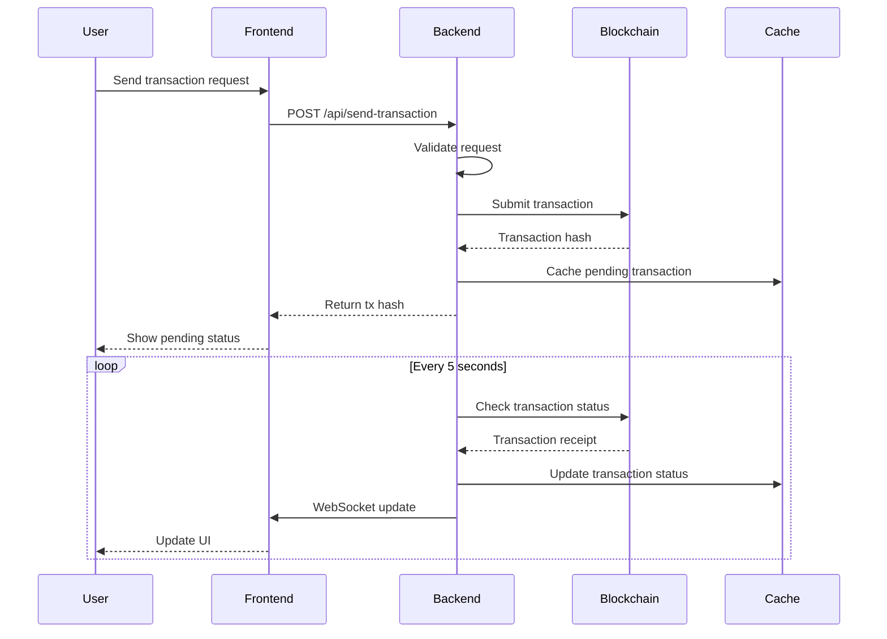
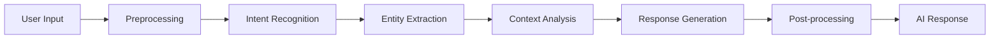
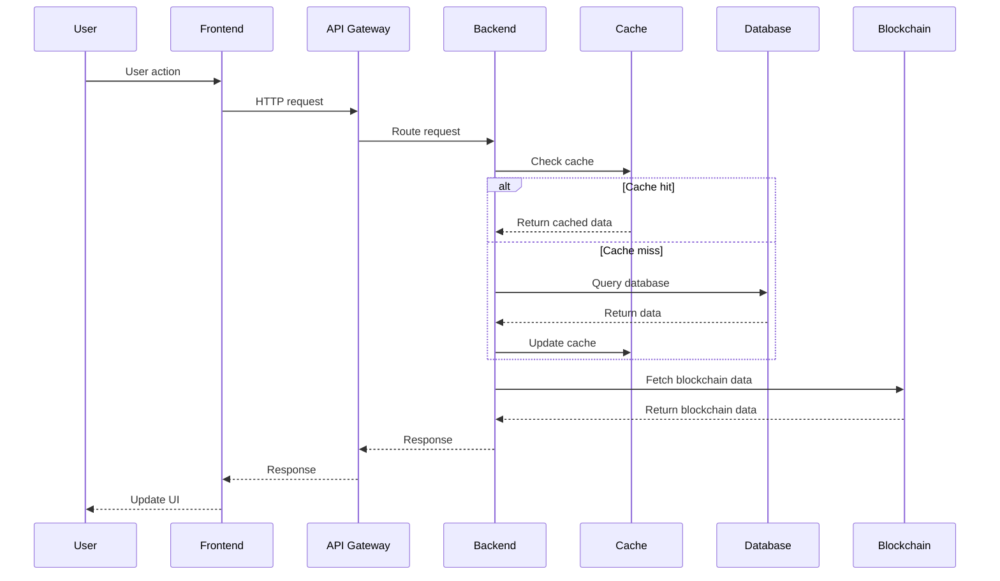
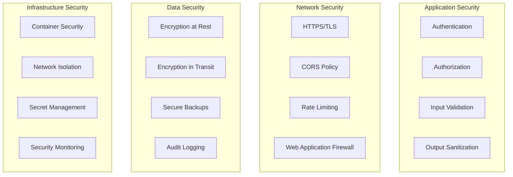
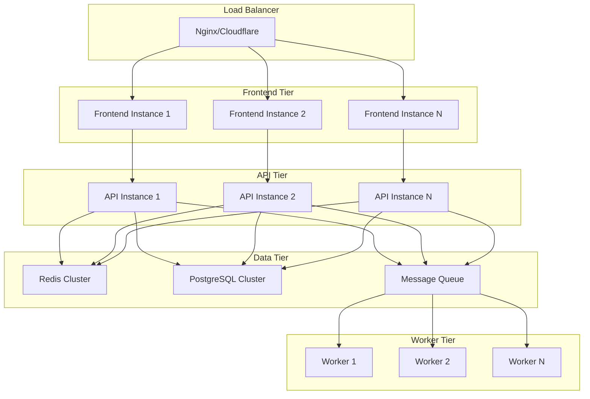
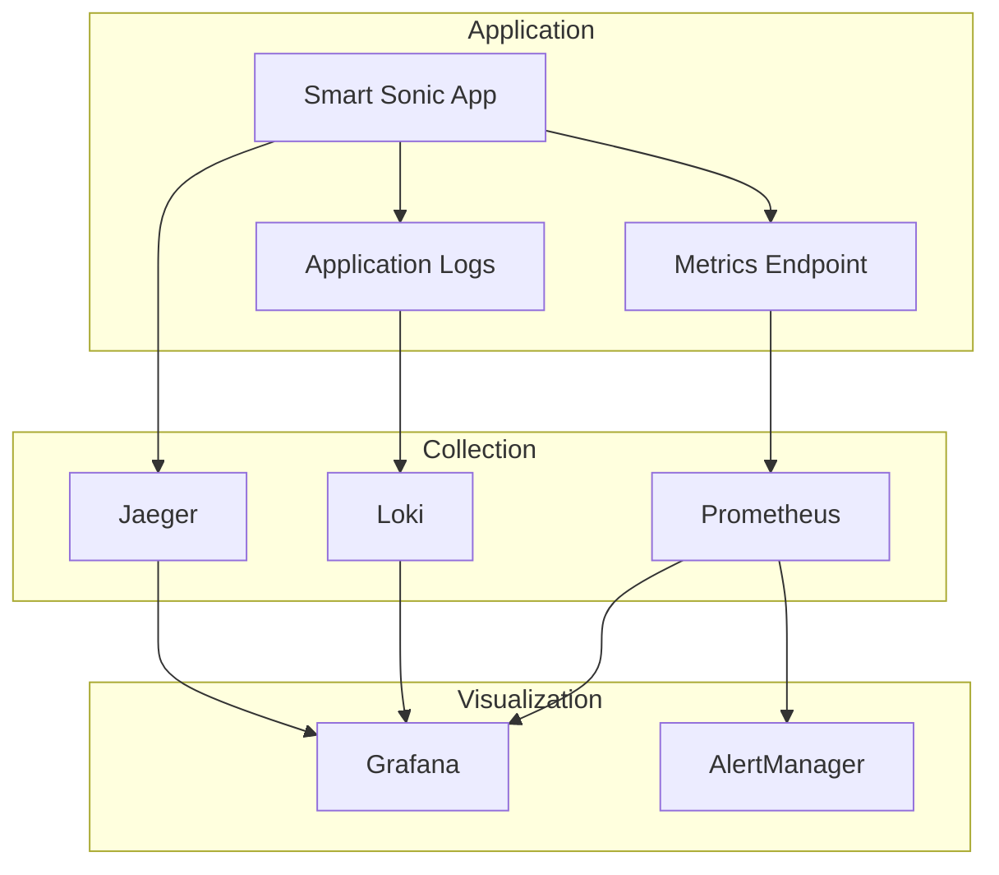

# 🏗️ Smart Sonic Architecture Guide

This document provides a comprehensive overview of Smart Sonic's system architecture, design patterns, and technical decisions.

## 🎯 System Overview

Smart Sonic is a modern, scalable AI-powered blockchain agent built with a microservices architecture. The system is designed to provide seamless interaction between users and the Sonic Network through natural language processing and intelligent automation.

### 🌟 Core Principles

- **🚀 Performance First** - Sub-second response times leveraging Sonic's speed
- **🔒 Security by Design** - Multi-layered security with best practices
- **📈 Scalable Architecture** - Horizontal scaling capabilities
- **🔄 Real-time Updates** - Live blockchain data synchronization
- **🎨 User-Centric Design** - Intuitive interfaces for all skill levels
- **🌐 Cross-Platform** - Web, mobile, and API compatibility

---

## 🏛️ High-Level Architecture



---

## 🎨 Frontend Architecture

### Technology Stack
- **Framework**: Next.js 14 with App Router
- **Language**: TypeScript
- **Styling**: Tailwind CSS
- **State Management**: React Hooks + Context API
- **Blockchain**: Wagmi + RainbowKit
- **Animation**: Framer Motion
- **Build Tool**: Webpack (via Next.js)

### Component Architecture

```
frontend/
├── app/                     # Next.js App Router
│   ├── layout.tsx          # Root layout
│   ├── page.tsx            # Home page
│   ├── globals.css         # Global styles
│   └── api/                # API routes (if needed)
├── components/             # React components
│   ├── ui/                 # Reusable UI components
│   │   ├── Button.tsx
│   │   ├── Card.tsx
│   │   └── Modal.tsx
│   ├── features/           # Feature-specific components
│   │   ├── ChatInterface.tsx
│   │   ├── TransactionHistory.tsx
│   │   ├── WalletConnect.tsx
│   │   └── NFTCreator.tsx
│   └── layout/             # Layout components
│       ├── Header.tsx
│       ├── Footer.tsx
│       └── Sidebar.tsx
├── hooks/                  # Custom React hooks
│   ├── useWallet.ts
│   ├── useTransactions.ts
│   └── useAI.ts
├── lib/                    # Utility libraries
│   ├── wagmi.ts           # Wagmi configuration
│   ├── utils.ts           # Helper functions
│   └── constants.ts       # App constants
├── types/                  # TypeScript type definitions
│   ├── api.ts
│   ├── blockchain.ts
│   └── ui.ts
└── styles/                 # Additional styles
    └── components.css
```

### State Management Strategy

#### Local State (React Hooks)
```typescript
// Component-level state
const [messages, setMessages] = useState<Message[]>([])
const [isLoading, setIsLoading] = useState(false)
```

#### Global State (Context API)
```typescript
// contexts/AppContext.tsx
interface AppContextType {
  user: User | null
  settings: AppSettings
  updateSettings: (settings: Partial<AppSettings>) => void
}

const AppContext = createContext<AppContextType | undefined>(undefined)
```

#### Blockchain State (Wagmi)
```typescript
// Wagmi hooks for blockchain state
const { address, isConnected } = useAccount()
const { data: balance } = useBalance({ address })
const { sendTransaction } = useSendTransaction()
```

### Performance Optimizations

#### Code Splitting
```typescript
// Dynamic imports for large components
const NFTCreator = dynamic(() => import('./NFTCreator'), {
  loading: () => <Skeleton />,
  ssr: false
})
```

#### Image Optimization
```typescript
// Next.js Image component
import Image from 'next/image'

<Image
  src="/logo.png"
  alt="Smart Sonic"
  width={200}
  height={100}
  priority
/>
```

#### Bundle Analysis
```bash
# Analyze bundle size
npm run build
npm run analyze
```

---

## 🔧 Backend Architecture

### Technology Stack
- **Framework**: FastAPI (Python)
- **Language**: Python 3.11+
- **Database**: PostgreSQL with SQLAlchemy ORM
- **Cache**: Redis
- **Queue**: Celery with Redis broker
- **Blockchain**: Web3.py
- **AI**: Google Gemini API
- **Deployment**: Docker + Kubernetes

### Service Architecture

```
backend/
├── main.py                 # FastAPI application entry
├── core/                   # Core application logic
│   ├── config.py          # Configuration management
│   ├── security.py        # Security utilities
│   ├── database.py        # Database connection
│   └── exceptions.py      # Custom exceptions
├── api/                    # API endpoints
│   ├── v1/                # API version 1
│   │   ├── endpoints/     # Endpoint modules
│   │   │   ├── transactions.py
│   │   │   ├── balance.py
│   │   │   ├── nft.py
│   │   │   └── defi.py
│   │   └── api.py         # API router
│   └── dependencies.py    # Dependency injection
├── services/              # Business logic services
│   ├── blockchain.py      # Blockchain interactions
│   ├── ai.py             # AI processing
│   ├── cache.py          # Caching service
│   └── notifications.py  # Notification service
├── models/                # Database models
│   ├── user.py
│   ├── transaction.py
│   └── subscription.py
├── schemas/               # Pydantic schemas
│   ├── transaction.py
│   ├── user.py
│   └── response.py
├── workers/               # Background workers
│   ├── blockchain_sync.py
│   ├── ai_processor.py
│   └── notification_sender.py
└── utils/                 # Utility functions
    ├── helpers.py
    ├── validators.py
    └── formatters.py
```

### Service Layer Pattern

#### Blockchain Service
```python
# services/blockchain.py
class BlockchainService:
    def __init__(self, rpc_url: str):
        self.w3 = Web3(Web3.HTTPProvider(rpc_url))
        self.cache = CacheService()
    
    async def get_transaction_history(
        self, 
        address: str, 
        limit: int = 50
    ) -> List[Transaction]:
        # Check cache first
        cache_key = f"tx_history:{address}:{limit}"
        cached = await self.cache.get(cache_key)
        if cached:
            return cached
        
        # Fetch from blockchain
        transactions = await self._fetch_transactions(address, limit)
        
        # Cache results
        await self.cache.set(cache_key, transactions, ttl=300)
        
        return transactions
```

#### AI Service
```python
# services/ai.py
class AIService:
    def __init__(self):
        self.client = genai.GenerativeModel('gemini-pro')
    
    async def process_user_message(
        self, 
        message: str, 
        context: Dict[str, Any]
    ) -> AIResponse:
        prompt = self._build_prompt(message, context)
        response = await self.client.generate_content_async(prompt)
        return self._parse_response(response)
```

### Database Design

#### Entity Relationship Diagram


#### Database Models
```python
# models/user.py
class User(Base):
    __tablename__ = "users"
    
    id = Column(UUID(as_uuid=True), primary_key=True, default=uuid.uuid4)
    address = Column(String, unique=True, index=True)
    email = Column(String, unique=True, index=True, nullable=True)
    created_at = Column(DateTime, default=datetime.utcnow)
    updated_at = Column(DateTime, default=datetime.utcnow, onupdate=datetime.utcnow)
    
    # Relationships
    transactions = relationship("Transaction", back_populates="user")
    subscriptions = relationship("Subscription", back_populates="user")
```

### Caching Strategy

#### Multi-Level Caching
```python
# services/cache.py
class CacheService:
    def __init__(self):
        self.redis = Redis.from_url(settings.REDIS_URL)
        self.local_cache = TTLCache(maxsize=1000, ttl=60)
    
    async def get(self, key: str) -> Any:
        # L1: Local cache
        if key in self.local_cache:
            return self.local_cache[key]
        
        # L2: Redis cache
        value = await self.redis.get(key)
        if value:
            parsed = json.loads(value)
            self.local_cache[key] = parsed
            return parsed
        
        return None
```

#### Cache Invalidation
```python
# Cache invalidation patterns
class TransactionService:
    async def create_transaction(self, tx_data: dict):
        # Create transaction
        transaction = await self.db.create(tx_data)
        
        # Invalidate related caches
        await self.cache.delete(f"tx_history:{tx_data['from_address']}")
        await self.cache.delete(f"balance:{tx_data['from_address']}")
        
        return transaction
```

---

## ⛓️ Blockchain Integration

### Sonic Network Integration

#### Network Configuration
```python
# config/networks.py
SONIC_NETWORKS = {
    "testnet": {
        "chain_id": 14601,
        "rpc_url": "https://rpc.testnet.soniclabs.com",
        "explorer_url": "https://testnet.soniclabs.com",
        "faucet_url": "https://testnet.soniclabs.com/faucet"
    },
    "mainnet": {
        "chain_id": 146,
        "rpc_url": "https://rpc.soniclabs.com",
        "explorer_url": "https://soniclabs.com",
        "faucet_url": None
    }
}
```

#### Smart Contract Architecture
```solidity
// contracts/SmartSonicSubscription.sol
contract SmartSonicSubscription is Ownable, ReentrancyGuard {
    using SafeMath for uint256;
    
    // State variables
    uint256 public constant SUBSCRIPTION_PRICE = 1 ether;
    uint256 public constant SUBSCRIPTION_DURATION = 30 days;
    
    mapping(address => Subscription) public subscriptions;
    mapping(address => uint256[]) public userSubscriptionHistory;
    
    // Events
    event SubscriptionPurchased(address indexed user, uint256 startTime, uint256 endTime);
    event SubscriptionRenewed(address indexed user, uint256 newEndTime);
    
    // Modifiers
    modifier onlyActiveSubscriber() {
        require(isSubscriptionActive(msg.sender), "No active subscription");
        _;
    }
    
    // Functions
    function purchaseSubscription() external payable nonReentrant {
        require(msg.value >= SUBSCRIPTION_PRICE, "Insufficient payment");
        
        Subscription storage sub = subscriptions[msg.sender];
        uint256 startTime = block.timestamp;
        uint256 endTime = startTime.add(SUBSCRIPTION_DURATION);
        
        if (sub.endTime > block.timestamp) {
            // Extend existing subscription
            endTime = sub.endTime.add(SUBSCRIPTION_DURATION);
        }
        
        sub.user = msg.sender;
        sub.startTime = startTime;
        sub.endTime = endTime;
        sub.active = true;
        
        emit SubscriptionPurchased(msg.sender, startTime, endTime);
    }
}
```

### Transaction Processing Pipeline



---

## 🤖 AI Integration Architecture

### Natural Language Processing Pipeline



### AI Service Implementation

#### Intent Recognition
```python
# services/ai/intent_recognition.py
class IntentRecognizer:
    def __init__(self):
        self.intents = {
            "balance_check": ["balance", "how much", "tokens", "wallet"],
            "send_transaction": ["send", "transfer", "pay", "to"],
            "transaction_history": ["history", "transactions", "activity"],
            "nft_creation": ["nft", "create", "mint", "artwork"],
            "defi_query": ["defi", "yield", "farm", "pool", "stake"]
        }
    
    def recognize_intent(self, message: str) -> str:
        message_lower = message.lower()
        scores = {}
        
        for intent, keywords in self.intents.items():
            score = sum(1 for keyword in keywords if keyword in message_lower)
            if score > 0:
                scores[intent] = score
        
        return max(scores, key=scores.get) if scores else "general_query"
```

#### Entity Extraction
```python
# services/ai/entity_extraction.py
class EntityExtractor:
    def __init__(self):
        self.patterns = {
            "ethereum_address": r"0x[a-fA-F0-9]{40}",
            "transaction_hash": r"0x[a-fA-F0-9]{64}",
            "amount": r"\d+(?:\.\d+)?",
            "token_symbol": r"\b[A-Z]{2,5}\b"
        }
    
    def extract_entities(self, message: str) -> Dict[str, List[str]]:
        entities = {}
        
        for entity_type, pattern in self.patterns.items():
            matches = re.findall(pattern, message)
            if matches:
                entities[entity_type] = matches
        
        return entities
```

### Response Generation
```python
# services/ai/response_generator.py
class ResponseGenerator:
    def __init__(self):
        self.gemini_client = genai.GenerativeModel('gemini-pro')
    
    async def generate_response(
        self, 
        intent: str, 
        entities: Dict[str, Any], 
        context: Dict[str, Any]
    ) -> AIResponse:
        prompt = self._build_prompt(intent, entities, context)
        
        response = await self.gemini_client.generate_content_async(prompt)
        
        return AIResponse(
            text=response.text,
            intent=intent,
            entities=entities,
            actions=self._extract_actions(response.text)
        )
```

---

## 🔄 Real-time Architecture

### WebSocket Implementation

#### Connection Management
```python
# services/websocket.py
class ConnectionManager:
    def __init__(self):
        self.active_connections: Dict[str, WebSocket] = {}
        self.user_subscriptions: Dict[str, Set[str]] = {}
    
    async def connect(self, websocket: WebSocket, user_id: str):
        await websocket.accept()
        self.active_connections[user_id] = websocket
        self.user_subscriptions[user_id] = set()
    
    async def disconnect(self, user_id: str):
        if user_id in self.active_connections:
            del self.active_connections[user_id]
            del self.user_subscriptions[user_id]
    
    async def subscribe_to_address(self, user_id: str, address: str):
        if user_id in self.user_subscriptions:
            self.user_subscriptions[user_id].add(address)
    
    async def broadcast_transaction_update(self, address: str, transaction: dict):
        for user_id, subscriptions in self.user_subscriptions.items():
            if address in subscriptions:
                websocket = self.active_connections.get(user_id)
                if websocket:
                    await websocket.send_json({
                        "type": "transaction_update",
                        "data": transaction
                    })
```

### Event-Driven Architecture

#### Event System
```python
# services/events.py
class EventBus:
    def __init__(self):
        self.subscribers: Dict[str, List[Callable]] = {}
    
    def subscribe(self, event_type: str, handler: Callable):
        if event_type not in self.subscribers:
            self.subscribers[event_type] = []
        self.subscribers[event_type].append(handler)
    
    async def publish(self, event_type: str, data: Any):
        if event_type in self.subscribers:
            for handler in self.subscribers[event_type]:
                await handler(data)

# Usage
event_bus = EventBus()

# Subscribe to transaction events
event_bus.subscribe("transaction_confirmed", update_user_balance)
event_bus.subscribe("transaction_confirmed", send_notification)
event_bus.subscribe("transaction_confirmed", update_transaction_history)

# Publish event
await event_bus.publish("transaction_confirmed", {
    "hash": "0x123...",
    "from": "0xabc...",
    "to": "0xdef...",
    "amount": "1.5"
})
```

---

## 📊 Data Flow Architecture

### Request/Response Flow



### Data Synchronization

#### Blockchain Data Sync
```python
# workers/blockchain_sync.py
class BlockchainSyncWorker:
    def __init__(self):
        self.w3 = Web3(Web3.HTTPProvider(settings.SONIC_RPC_URL))
        self.db = DatabaseService()
        self.cache = CacheService()
    
    async def sync_latest_blocks(self):
        latest_block = self.w3.eth.block_number
        last_synced = await self.db.get_last_synced_block()
        
        for block_number in range(last_synced + 1, latest_block + 1):
            await self.sync_block(block_number)
    
    async def sync_block(self, block_number: int):
        block = self.w3.eth.get_block(block_number, full_transactions=True)
        
        for tx in block.transactions:
            await self.process_transaction(tx)
        
        await self.db.update_last_synced_block(block_number)
```

---

## 🔒 Security Architecture

### Multi-Layer Security



### Security Implementation

#### Input Validation
```python
# schemas/validation.py
class TransactionRequest(BaseModel):
    to_address: str = Field(..., regex=r"^0x[a-fA-F0-9]{40}$")
    amount: Decimal = Field(..., gt=0, le=1000000)
    gas_limit: Optional[int] = Field(21000, ge=21000, le=500000)
    
    @validator('to_address')
    def validate_address(cls, v):
        if not Web3.isAddress(v):
            raise ValueError('Invalid Ethereum address')
        return Web3.toChecksumAddress(v)
```

#### Rate Limiting
```python
# middleware/rate_limiting.py
class RateLimitMiddleware:
    def __init__(self, requests_per_minute: int = 60):
        self.requests_per_minute = requests_per_minute
        self.redis = Redis.from_url(settings.REDIS_URL)
    
    async def __call__(self, request: Request, call_next):
        client_ip = request.client.host
        key = f"rate_limit:{client_ip}"
        
        current_requests = await self.redis.incr(key)
        if current_requests == 1:
            await self.redis.expire(key, 60)
        
        if current_requests > self.requests_per_minute:
            raise HTTPException(
                status_code=429,
                detail="Rate limit exceeded"
            )
        
        response = await call_next(request)
        return response
```

---

## 📈 Scalability Architecture

### Horizontal Scaling Strategy



### Performance Optimization

#### Database Optimization
```sql
-- Indexing strategy
CREATE INDEX CONCURRENTLY idx_transactions_address_timestamp 
ON transactions (from_address, timestamp DESC);

CREATE INDEX CONCURRENTLY idx_transactions_hash 
ON transactions (hash);

CREATE INDEX CONCURRENTLY idx_users_address 
ON users (address);

-- Partitioning for large tables
CREATE TABLE transactions_2024_01 PARTITION OF transactions
FOR VALUES FROM ('2024-01-01') TO ('2024-02-01');
```

#### Caching Strategy
```python
# Multi-level caching implementation
class CacheStrategy:
    def __init__(self):
        self.l1_cache = TTLCache(maxsize=1000, ttl=60)  # Local cache
        self.l2_cache = Redis.from_url(settings.REDIS_URL)  # Distributed cache
    
    async def get_with_fallback(self, key: str, fetch_func: Callable):
        # L1 Cache
        if key in self.l1_cache:
            return self.l1_cache[key]
        
        # L2 Cache
        cached = await self.l2_cache.get(key)
        if cached:
            data = json.loads(cached)
            self.l1_cache[key] = data
            return data
        
        # Fetch from source
        data = await fetch_func()
        
        # Update caches
        await self.l2_cache.setex(key, 300, json.dumps(data))
        self.l1_cache[key] = data
        
        return data
```

---

## 🚀 Deployment Architecture

### Container Strategy

#### Dockerfile
```dockerfile
# Frontend Dockerfile
FROM node:18-alpine AS builder
WORKDIR /app
COPY package*.json ./
RUN npm ci --only=production
COPY . .
RUN npm run build

FROM node:18-alpine AS runner
WORKDIR /app
COPY --from=builder /app/.next ./.next
COPY --from=builder /app/public ./public
COPY --from=builder /app/package.json ./package.json
COPY --from=builder /app/node_modules ./node_modules
EXPOSE 3000
CMD ["npm", "start"]
```

#### Docker Compose
```yaml
# docker-compose.yml
version: '3.8'

services:
  frontend:
    build: ./frontend
    ports:
      - "3000:3000"
    environment:
      - NEXT_PUBLIC_API_URL=http://backend:8000
    depends_on:
      - backend

  backend:
    build: ./backend
    ports:
      - "8000:8000"
    environment:
      - DATABASE_URL=postgresql://user:pass@db:5432/smartsonic
      - REDIS_URL=redis://redis:6379
    depends_on:
      - db
      - redis

  db:
    image: postgres:15
    environment:
      - POSTGRES_DB=smartsonic
      - POSTGRES_USER=user
      - POSTGRES_PASSWORD=pass
    volumes:
      - postgres_data:/var/lib/postgresql/data

  redis:
    image: redis:7-alpine
    volumes:
      - redis_data:/data

volumes:
  postgres_data:
  redis_data:
```

### Kubernetes Deployment

#### Deployment Configuration
```yaml
# k8s/backend-deployment.yaml
apiVersion: apps/v1
kind: Deployment
metadata:
  name: smartsonic-backend
spec:
  replicas: 3
  selector:
    matchLabels:
      app: smartsonic-backend
  template:
    metadata:
      labels:
        app: smartsonic-backend
    spec:
      containers:
      - name: backend
        image: smartsonic/backend:latest
        ports:
        - containerPort: 8000
        env:
        - name: DATABASE_URL
          valueFrom:
            secretKeyRef:
              name: smartsonic-secrets
              key: database-url
        resources:
          requests:
            memory: "256Mi"
            cpu: "250m"
          limits:
            memory: "512Mi"
            cpu: "500m"
```

---

## 📊 Monitoring & Observability

### Monitoring Stack



### Metrics Implementation

#### Application Metrics
```python
# monitoring/metrics.py
from prometheus_client import Counter, Histogram, Gauge

# Request metrics
REQUEST_COUNT = Counter(
    'http_requests_total',
    'Total HTTP requests',
    ['method', 'endpoint', 'status']
)

REQUEST_DURATION = Histogram(
    'http_request_duration_seconds',
    'HTTP request duration',
    ['method', 'endpoint']
)

# Business metrics
ACTIVE_USERS = Gauge('active_users_total', 'Number of active users')
TRANSACTIONS_PROCESSED = Counter('transactions_processed_total', 'Total transactions processed')
BLOCKCHAIN_SYNC_LAG = Gauge('blockchain_sync_lag_blocks', 'Blocks behind latest')

# Usage in endpoints
@app.middleware("http")
async def metrics_middleware(request: Request, call_next):
    start_time = time.time()
    
    response = await call_next(request)
    
    REQUEST_COUNT.labels(
        method=request.method,
        endpoint=request.url.path,
        status=response.status_code
    ).inc()
    
    REQUEST_DURATION.labels(
        method=request.method,
        endpoint=request.url.path
    ).observe(time.time() - start_time)
    
    return response
```

---

## 🔄 CI/CD Pipeline

### GitHub Actions Workflow

```yaml
# .github/workflows/deploy.yml
name: Deploy Smart Sonic

on:
  push:
    branches: [main]
  pull_request:
    branches: [main]

jobs:
  test:
    runs-on: ubuntu-latest
    steps:
    - uses: actions/checkout@v3
    
    - name: Setup Node.js
      uses: actions/setup-node@v3
      with:
        node-version: '18'
        cache: 'npm'
    
    - name: Install dependencies
      run: npm ci
    
    - name: Run tests
      run: npm test
    
    - name: Build frontend
      run: cd frontend && npm run build

  deploy:
    needs: test
    runs-on: ubuntu-latest
    if: github.ref == 'refs/heads/main'
    
    steps:
    - uses: actions/checkout@v3
    
    - name: Deploy to production
      run: |
        # Deployment commands
        kubectl apply -f k8s/
```

---

## 📚 Additional Resources

### Architecture Decisions Records (ADRs)
- [ADR-001: Technology Stack Selection](./adrs/001-technology-stack.md)
- [ADR-002: Database Choice](./adrs/002-database-choice.md)
- [ADR-003: Caching Strategy](./adrs/003-caching-strategy.md)

### Performance Benchmarks
- **API Response Time**: < 100ms (95th percentile)
- **Transaction Processing**: < 2 seconds end-to-end
- **WebSocket Latency**: < 50ms
- **Database Query Time**: < 10ms (95th percentile)

### Capacity Planning
- **Concurrent Users**: 10,000+
- **Transactions per Second**: 1,000+
- **API Requests per Minute**: 100,000+
- **Storage Growth**: 1GB per month

---

*This architecture guide is a living document and will be updated as the system evolves.*

---

*Last updated: January 2024*
*Version: 1.0.0*